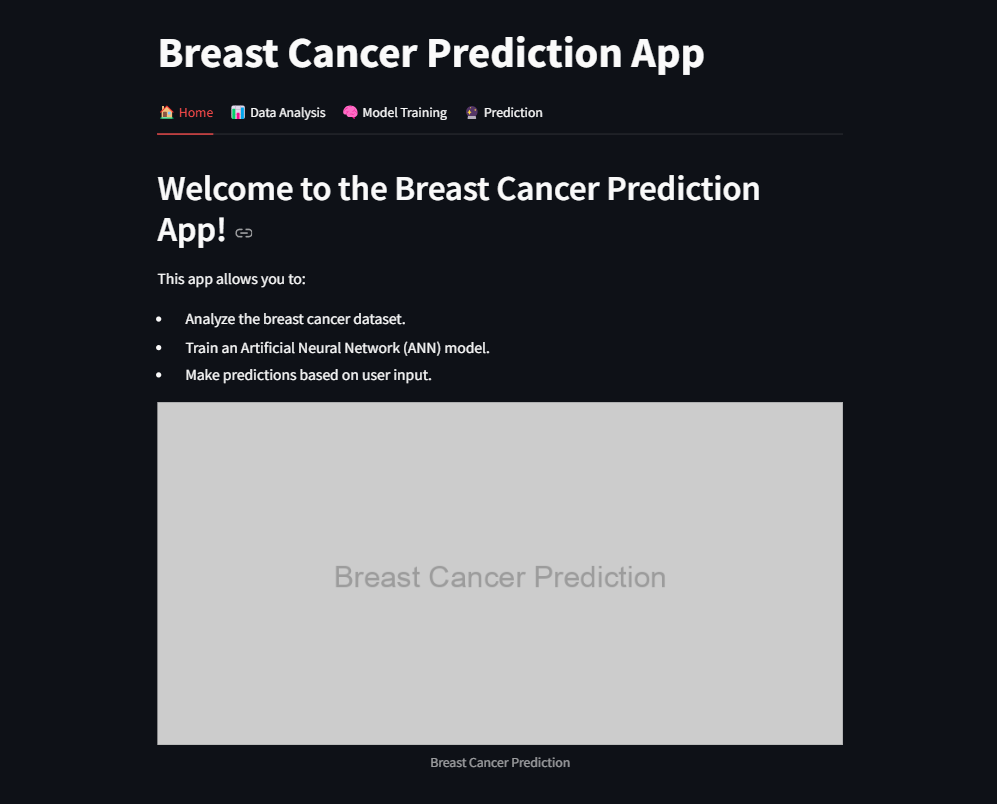
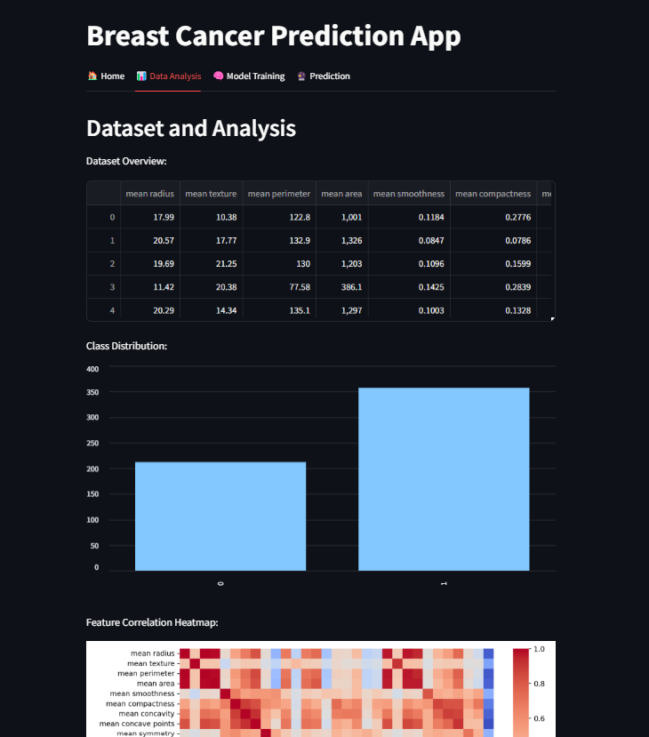
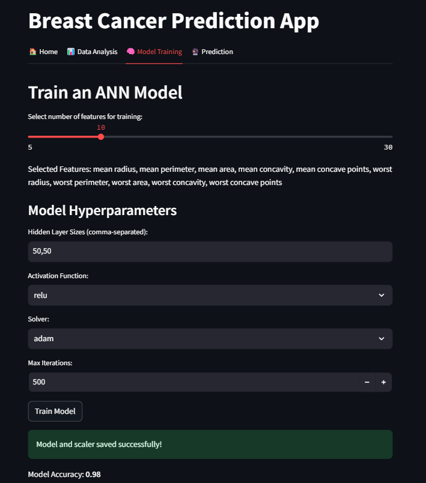
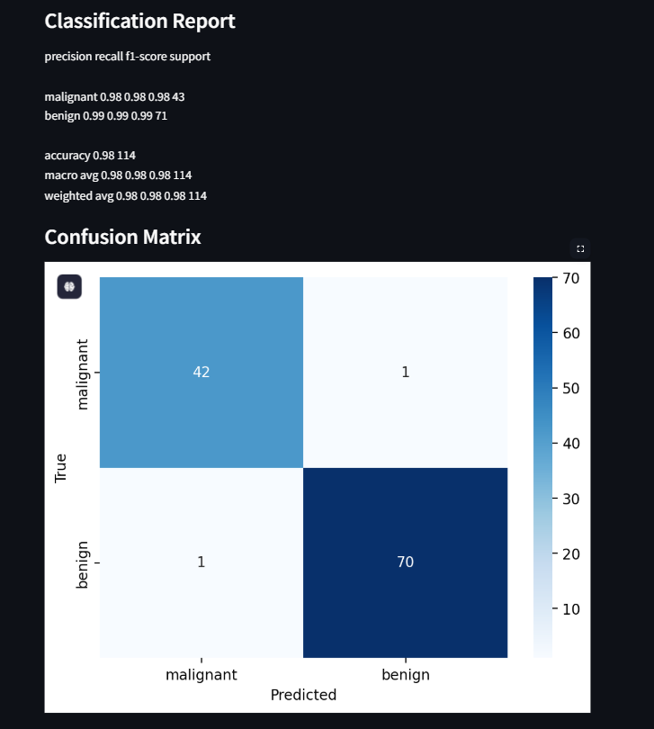
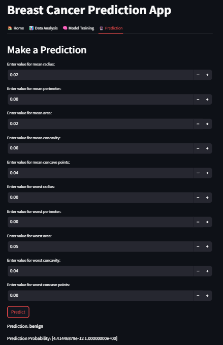

# Breast Cancer Prediction Application

This project is a machine learning-based application developed to predict breast cancer diagnoses using clinical features. The app is built with an Artificial Neural Network (ANN) model and provides an intuitive interface using **Streamlit** for data analysis, model training, and making predictions.

---

## Key Features

1. **Data Analysis**:
   - Explore dataset characteristics, class distributions, and feature correlations.
   - Visualize insights using interactive charts and heatmaps.

2. **Model Training**:
   - Build an ANN model with customizable hyperparameters.
   - Assess the model’s performance using accuracy metrics, classification reports, and confusion matrices.
   - Save the trained model and scaler for reuse.

3. **Prediction**:
   - Provide feature inputs to get predictions from the trained model.
   - Display the diagnosis (Malignant or Benign) along with prediction probabilities.

---

## Project Directory Structure
BREAST_CANCER_ANALYSIS/ 
├── ann_model.ipynb # Scripts for data loading, feature selection, splitting, and scaling, training, saving, and evaluating the ANN model 
├── streamlit_app.py # Streamlit application for user interaction 
├── README.md # Documentation for the project 
├── ann_model.pkl # Saved trained ANN model 
├── scaler.pkl # Saved scaler for preprocessing

## 2. Install Required Libraries

Create a virtual environment and install the necessary dependencies:

```bash
python -m venv venv
venv\Scripts\activate          
pip install -r requirements.txt

pip install pandas numpy scikit-learn matplotlib seaborn streamlit

```

## 3. Run the Application
Start the Streamlit application:

```bash
streamlit run streamlit_app.py
```
Access the app through the URL provided in your terminal (usually http://localhost:8507/).

# Dataset Description
---
The project utilizes the Breast Cancer Wisconsin (Diagnostic) dataset, which is available in the sklearn.datasets module. The dataset comprises:

569 samples
30 features describing tumor characteristics
Labels indicating whether the tumor is Malignant or Benign

---

## 4. How to Use the Application
# Data Analysis
Open the Data Analysis tab in the app.
View statistics, class distributions, and a heatmap of feature correlations.
---
# Model Training
Navigate to the Model Training tab.
Adjust hyperparameters like hidden layer sizes, activation functions, and solvers.
Train the ANN model and evaluate its performance (accuracy, classification report, confusion matrix).
The model and scaler are saved as ann_model.pkl and scaler.pkl for reuse.
---
# Prediction
Go to the Prediction tab.
Enter values for the selected features.
Get the predicted diagnosis (Malignant or Benign) along with probabilities.
---











